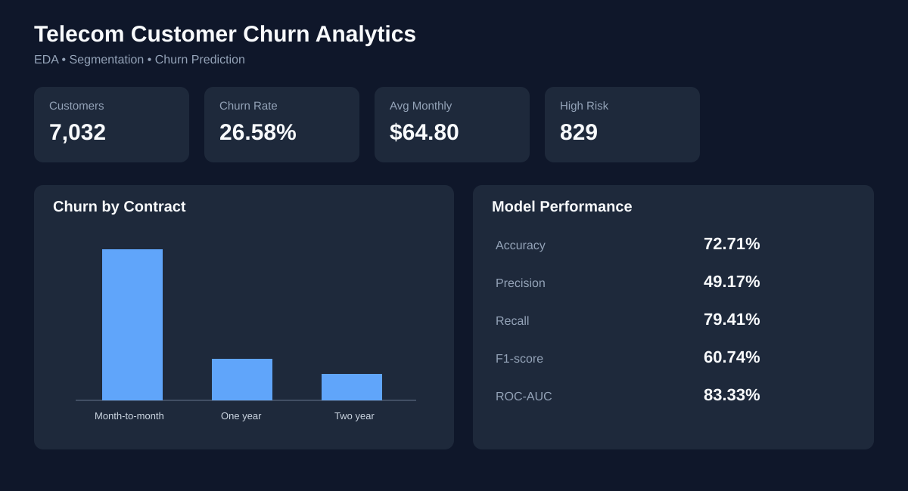
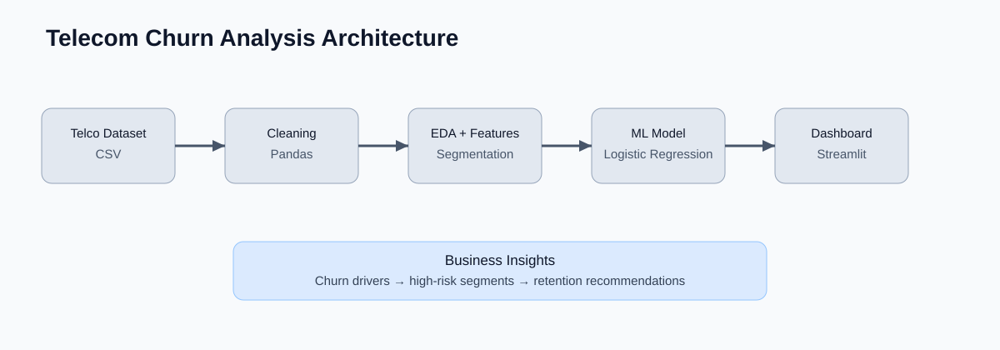

# 📊 Telecom Customer Churn Analysis & Prediction

A recruiter-ready **Python data analytics and machine learning project** that analyzes telecom customer churn, segments high-risk customers, and predicts churn using Logistic Regression.

> **Project status:** Portfolio-ready. The repository includes reproducible data loading, feature engineering, EDA, ML evaluation, automated tests, and an interactive Streamlit dashboard.

## 🚀 Dashboard Preview



## 🧠 What the project demonstrates

```text
Telco Customer Data
        ↓
Data Cleaning & Validation
        ↓
Feature Engineering
        ↓
Exploratory Data Analysis
        ↓
Customer Segmentation
        ↓
Churn Prediction Model
        ↓
Precision / Recall / F1 / ROC-AUC
        ↓
Business Insights & Retention Recommendations
        ↓
Interactive Streamlit Dashboard
```

## ✨ Key Features

- Portable CSV-based data loading — no machine-specific file paths
- Missing-value handling and duplicate removal
- Churn encoding and reusable feature engineering
- Customer segmentation by **tenure** and **monthly spending**
- Contract, payment method, tenure and charge analysis
- GroupBy and pivot-table analysis
- High-risk customer segment identification
- Logistic Regression churn prediction pipeline
- One-hot encoding, imputation and feature scaling through a reproducible sklearn pipeline
- Evaluation with **Accuracy, Precision, Recall, F1-score and ROC-AUC**
- Confusion matrix analysis
- Interactive Streamlit dashboard
- Automated pytest regression tests
- Clean modular project structure

## 📌 Dataset

The project uses the commonly used **Telco Customer Churn** dataset with approximately 7,000 customer records covering demographics, services, contracts, billing and churn status.

The dataset is included in the repository for reproducible portfolio analysis.

## 📈 Actual Analysis Results

The current dataset contains **7,032 cleaned customer records** with an overall churn rate of **26.58%**.

| Metric | Result |
|---|---:|
| Customers analyzed | 7,032 |
| Overall churn rate | 26.58% |
| Average monthly charges | $64.80 |
| Average tenure | 32.4 months |
| New + high-spending customers | 829 |
| Month-to-month churn | 42.71% |
| One-year contract churn | 11.28% |
| Two-year contract churn | 2.85% |

### Model evaluation

Using an 80/20 stratified train-test split and Logistic Regression:

| Metric | Score |
|---|---:|
| Accuracy | 72.71% |
| Precision | 49.17% |
| Recall | 79.41% |
| F1-score | 60.74% |
| ROC-AUC | 83.33% |

**Why multiple metrics?** Churn datasets are imbalanced, so accuracy alone can be misleading. Recall and ROC-AUC provide additional information about the model's ability to identify customers likely to churn.

## 🔎 Key Business Insights

- **Month-to-month customers show the highest churn rate (42.71%)**, compared with 11.28% for one-year contracts and 2.85% for two-year contracts.
- Customers with shorter tenure are more vulnerable to churn, making early-stage retention important.
- Higher monthly charges are associated with increased churn risk in the exploratory analysis.
- The project identifies **829 customers in the New + High Spending segment** as a practical high-priority segment for retention analysis.
- Payment method and service choices can be used to further segment customers for targeted retention campaigns.

## 💼 Business Recommendations

1. Offer incentives for month-to-month customers to move to longer contracts.
2. Create an onboarding/retention program for new customers during their first year.
3. Target high-value, high-risk customers with personalized plans or service offers.
4. Investigate payment-method friction and proactively support customers showing churn risk.
5. Use the churn model as a prioritization tool rather than treating predictions as guaranteed outcomes.

## 🛠️ Technology Stack

| Area | Technology |
|---|---|
| Language | Python |
| Data analysis | Pandas, NumPy |
| Visualization | Matplotlib, Seaborn |
| Machine learning | Scikit-learn |
| Dashboard | Streamlit |
| Testing | Pytest |
| Version control | Git / GitHub |

## 📁 Project Structure

```text
telecom-churn-analysis/
├── assets/
│   ├── architecture.svg
│   └── dashboard-preview.svg
├── dashboard/
│   └── app.py
├── src/
│   ├── __init__.py
│   ├── analysis.py
│   ├── data.py
│   └── model.py
├── tests/
│   └── test_analysis.py
├── WA_Fn-UseC_-Telco-Customer-Churn.csv
├── run_analysis.py
├── telcom.py
├── requirements.txt
├── .gitignore
└── README.md
```



## ▶️ Run Locally

### 1. Clone the repository

```bash
git clone https://github.com/Anurag20048/telcom-data-analysis.git
cd telcom-data-analysis
```

### 2. Create a virtual environment

**Windows:**

```powershell
python -m venv .venv
.\.venv\Scripts\Activate.ps1
```

**macOS/Linux:**

```bash
python3 -m venv .venv
source .venv/bin/activate
```

### 3. Install dependencies

```bash
pip install -r requirements.txt
```

### 4. Run the analysis

```bash
python run_analysis.py
```

### 5. Run tests

```bash
pytest -q
```

### 6. Launch the dashboard

```bash
streamlit run dashboard/app.py
```

The dashboard loads the dataset from the repository using a portable project-relative path, so it does not depend on the author's computer directory.

## 🧪 Validation

The project was tested locally after the refactor:

- **3/3 automated tests passed**
- Analysis pipeline executed successfully
- Dataset loaded from the repository path
- Model trained successfully
- Precision, recall, F1 and ROC-AUC were calculated

The ML score is a benchmark on this dataset, not a claim of production performance.

## ⚠️ Limitations

- This is a portfolio analysis project, not a production churn service.
- Logistic Regression is used as an interpretable baseline; additional models could be benchmarked.
- Results depend on the provided dataset and train/test split.
- Historical churn relationships should not automatically be interpreted as causal relationships.
- A deployed dashboard and external monitoring are not included in this repository.

## 🔮 Future Improvements

- Compare Logistic Regression with Random Forest and XGBoost.
- Add cross-validation and hyperparameter tuning.
- Add model explainability using feature importance/SHAP.
- Add SQL-based analysis alongside the Python workflow.
- Deploy the Streamlit dashboard.
- Add automated model/data-quality checks in CI.

## 👨‍💻 Author

**Anurag Pareek** — Python | Data Analysis | Machine Learning | Data Visualization
